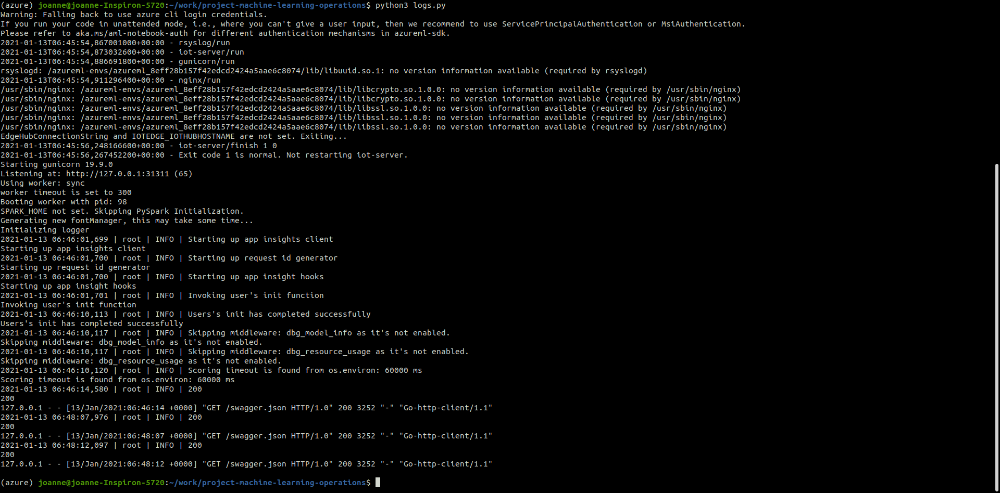

# Project 2 - Operationalizing Machine Learning

*This project is part of the Udacity Azure Machine Learning Engineer Nanodegree.*  
The aim of this project is to use Azure to configure a cloud-based machine learning production model, deploy it and consume it. Then the workflow is automated by creating and publishing a pipeline. 

**Key Steps**
<ol>
<li>Authentication</li>
<li>Automated ML Experiment</li>
<li>Deploy the best model</li>
<li>Enable logging</li>
<li>Swagger Documentation</li>
<li>Consume model endpoints</li>
<li>Create and publish a pipeline</li>
</ol>

## Architectural Diagram
 
The above diagram shows the overall workflow of the project. First a Service Principal is created for the workspace. Then an AutoML experiment is run and the best model is selected and deployed. Then the deployed model is consumed through the REST endpoint. Finally the workflow is automated by creating a pipeline and publishing it. 

## Key Steps
### 1. Authentication 
For this experiment the lab which Udacity provided has been used. This step is skipped since this account is not authorized to create a security principal.

### 2. Automated ML Experiment
The project uses the [UCI Bank Marketing Dataset](https://archive.ics.uci.edu/ml/datasets/Bank+Marketing) that contains data about banking clients, including personal details of clients like age, job, marital status etc and details regarding maketing campaign.
The goal is to predict whether the client will subscribe a term deposit or not, thus making it a binary classification problem with two classes - *'yes'* and *'no'*.

The first step is to upload the dataset and register it.
 
 

The a compute cluster was configured for the AutoML run with Standard_DS12_v2 as the VM size and 1 as the minimum number of nodes. Then the AutoML experiment is run using *Classification* and the best model is selected.
 
 

### 3. Deploy the Best Model
In this experiment, the best model obtained used the Voting Ensemble algorithm. The model is deployed using Azure Container Instance and authentication is enabled. Azure Container Instance service uses key-based authentication and is disabled by default. Deploying the best model allows interaction with the HTTP API servie and data can be sent over POST requests.

### 4. Enable Application Insights
Application Insights is a very useful tool to detect anomalies and visualise performance. The logs.py script is used to enable application insights after deployment. The script is run using Azure command line interface.

### 5. Swagger Documentation
Swagger is a tool that helps build, document and consume RESTful web services. It explains what types of HTTP requests that an API can consume like POST and GET. 
Azure provised a swagger.json that is used to create a website that documents the HTTP endpoing for the deployed model. 
Both swagger.sh and serve.py is run with swagger.json being in the same folder. Swagger is run on localhost and the HTTP API methods and responses for the deployed model is displayed and can be interacted with.

### 6. Consume Model Enpoints
The script endpoint.py is used to interact with the deployed model after setting the scoring_uri and the primary key. endpoint.py runs against the API and produces JSON output from the model.

Apache Benchmark is used to load-test the deployed model. It shows a lot of metrics including response time for a deployed model. After configuring the authentication keys, benchmark.sh was run. In this experiment, 10 requests were made where none failed. The average time per request was 755.516 ms.

### 7. Create and Publish a Pipeline
The Jupyter Notebook provided is run after configuring necessary details.  
Pipelines are a great way to automate workflows. Published pipelines allow external services to interact with them so that they can do work more efficiently.

A new pipeline is created with an AutoML step. The pipeline experiment is run and details are displayed using RunDetails widget. The pipeline run overview shows the run status and details. 

The pipeline is published using the SDK. Once published, the endpoint details are available and the published pipeline overview can be viewed.

## Screen Recording
[Link to the screen recording of the project](https://youtu.be/2nz4JW99MM8)

## Standout Suggestions

<ul>
<li>Apache Benchmark has been used here to load-test the model</li>
<li>For future projects, creation of Service Principal can be attempted.</li>
<li>The first part of the project (ie, creation of compute, the AutoML run and deployment) are done through the interface. This can be made to run using the SDK.</li>
<li>To consume the model, along with using the Python script, a basic UI front-end can be implemented with provisions for entering each parameter and for displaying the response.</li>
</ul>