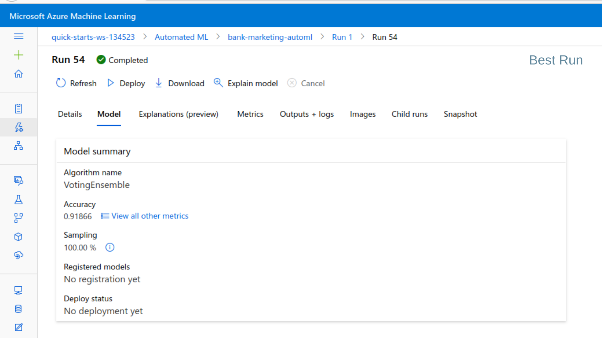

# Project 2 - Operationalizing Machine Learning

*This project is part of the Udacity Azure Machine Learning Engineer Nanodegree.*  
The aim of this project is to use Azure to configure a cloud-based machine learning production model, deploy it and consume it. Then the workflow is automated by creating and publishing a pipeline. 

**Key Steps**
<ol>
<li>Authentication</li>
<li>Automated ML Experiment</li>
<li>Deploy the best model</li>
<li>Enable logging</li>
<li>Swagger Documentation</li>
<li>Consume model endpoints</li>
<li>Create and publish a pipeline</li>
</ol>

## Architectural Diagram
 
The above diagram shows the overall workflow of the project. First a Service Principal is created for the workspace. Then an AutoML experiment is run and the best model is selected and deployed. Then the deployed model is consumed through the REST endpoint. Finally the workflow is automated by creating a pipeline and publishing it. 

## Key Steps
### 1. Authentication 
For this experiment the lab which Udacity provided has been used. This step is skipped since this account is not authorized to create a security principal.

### 2. Automated ML Experiment
**Dataset Description** 
The project uses the [UCI Bank Marketing Dataset](https://archive.ics.uci.edu/ml/datasets/Bank+Marketing) that contains data about banking clients, including personal details of clients like age, job, marital status etc and details regarding maketing campaign.
The goal is to predict whether the client will subscribe a term deposit or not, thus making it a binary classification problem with two classes - *'yes'* and *'no'*.  

**Uploading and Registering Dataset** 
The first step is to upload the dataset and register it. The dataset is uploaded as a Tabular Dataset object using a CSV file.  
This screenshot below shows the registered dataset.
   
The details of the uploaded dataset is viewed in the Details tab. 
 

**Compute Cluster Description** 
A compute cluster was configured for the AutoML run with *Standard_DS12_v2* as the VM size and 1 as the minimum number of nodes. A compute cluster is a managed compute infrastructure that allows you to easily create a single or multi-node compute. The minimum number of nodes denote the minimum number of nodes allocated.   
**AutoML Configuration and Run** 
The problem statement here is a binary classification problem. So the AutoML experiment is run using *Classification* and the best model is selected. 
**The screenshot below shows that in the experiment, the AutoML run with the bankmarketing data is completed.** 
*The properties section shows the status of the run as 'Completed.'*
  
   
**Choosing the Best Model** 
After the AutoML run completed, the best model summary showed the best run and the algorithm used. Here the best model is a Voting Ensemble model, which had an accuracy of **0.91866**.  A Voting Ensemble is a machine learning model that trains on an ensemble of numerous models and predicts an output based on their highest probability of chosen class as input.  
 

### 3. Deploy the Best Model
In this experiment, the best model obtained used the Voting Ensemble algorithm. During deployment, **authentication is enabled**. Authentication is crucial for the continuous flow of operations, as Continuous Integration and Delivery systems rely on uninterrupted flows. The screenshot below shows thet *Key based authentication enabled* as *true*. 
The model is deployed using **Azure Container Instance**. Azure Container Instance service uses key-based authentication and is disabled by default. Deploying the best model allows interaction with the HTTP API servie and data can be sent over POST requests.   
Once the deployment is transitioned, the state will be shown as *Healthy* as seen in the screenshot below. 

### 4. Enable Application Insights 
Application Insights is a very useful tool to detect anomalies and visualise performance. It can be enabled before or after deployment and the following information can be collected from the endpoint: 
<ul>
    <li>Output data</li>
    <li>Responses</li>
    <li>Request rates, response times and failure rates</li>
    <li>Dependency rates, response times and failure rates</li>
    <li>Exceptions</li>
</ul>

**Enabling Application Insights using Python SDK**  
The logs.py script is used to enable application insights after deployment. The script is run using Azure command line interface. 
The statement `service.update(enable_app_insights=True)` enables application insights for the deployment.  

The screenshot below is of the log output, which is the informational output produced by the software, in the form of text.
   
Since the application insights have been enabled, it's shown as *true* in the properties section.
   
The Application Insights URL is a link to the Application Insights dashboard for the endpoint. 

### 5. Swagger Documentation
Swagger is a tool that helps build, document and consume RESTful web services. It explains what types of HTTP requests that an API can consume like POST and GET.    
**Hosting Swagger Locally**  
Azure provised a swagger.json that is used to create a website that documents the HTTP endpoing for the deployed model. 
Both swagger.sh and serve.py is run with swagger.json being in the same folder. Swagger is run on localhost and the HTTP API methods and responses for the deployed model is displayed and can be interacted with.  
 This is the API documentation page:
  
The **HTTP GET** is used to retrieve information from a URL.The parameters and responses of the HTTP GET request are as follows:
  
The **HTTP POST** request is a method used to submit data. The parameters and responses of the HTTP POST request are as follows:

### 6. Consume Model Enpoints
The script endpoint.py is used to interact with the deployed model after setting the scoring_uri and the primary key. endpoint.py runs against the API and produces JSON output from the model. The endpoint.py in the repository sends two data instances and when run it returns the following output. The first instance is classified as *yes* and the second one as *no*.

Apache Benchmark is used to load-test the deployed model. It shows a lot of metrics including response time for a deployed model. After configuring the authentication keys, benchmark.sh was run. In this experiment, 10 requests were made where none failed. The average time per request was 755.516 ms.

### 7. Create and Publish a Pipeline
**Creating and Running a Pipeline** 
The Jupyter Notebook provided is run after configuring necessary details.  
Pipelines are a great way to automate workflows. Published pipelines allow external services to interact with them so that they can do work more efficiently.

A new pipeline is created with an AutoML step. The pipeline experiment is run and details are displayed using RunDetails widget. The pipeline run overview shows the run status and details. 

  
The screenshot below shows the pipeline being run.
  
The Pipeline run overview shows the details of the run as well as a graphical representation.

**Publishing the Pipeline** 
Publishing a pipeline is the process of making a pipeline publicly available. This can be done both using the SDK and the Studio. When a pipeline is published, a public HTTP endpoint becomes available, allowing other services including external ones to interact with an Azure Pipeline.   
In this experiment, the pipeline is published using the SDK. Once published, the endpoint details are available and the published pipeline overview can be viewed.
   
Published pipeline overview 
   
The HTTP endpoint is publically available

## Screen Recording
[Link to the screen recording of the project](https://youtu.be/2nz4JW99MM8)

## Standout Suggestions

<ul>
<li>Apache Benchmark has been used here to load-test the model</li>
<li>For future projects, creation of Service Principal can be attempted.</li>
<li>The first part of the project (ie, creation of compute, the AutoML run and deployment) are done through the interface. This can be made to run using the SDK.</li>
<li>To consume the model, along with using the Python script, a basic UI front-end can be implemented with provisions for entering each parameter and for displaying the response.</li>
</ul>